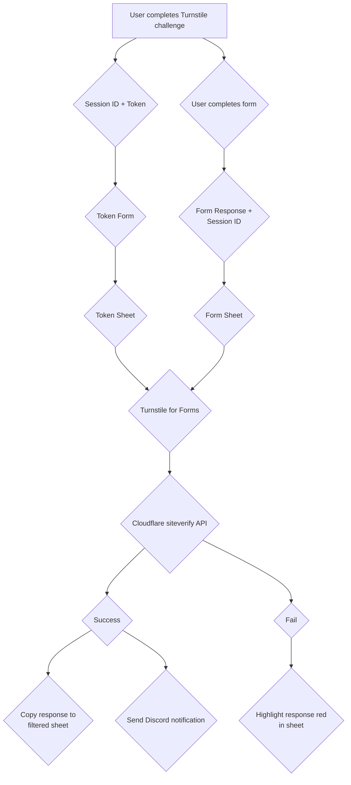

# Cloudflare Turnstile for Google Forms

This is a Google Apps Script for validating Google Forms responses using Cloudflare Turnstile. It requires the [accompanying frontend](https://github.com/ModMalwareInvestigation/turnstile-for-forms-frontend) to work.
This project was created using the [Google Forms Add-on Sample](https://github.com/googleworkspace/apps-script-samples/tree/main/forms).

# Usage
This add-on was designed for business Google Workspace accounts and may not work with a personal account.

## Requirements
### Node and NPM
This project requires Node 18.17.1 LTS or higher and a package manager such as NPM, yarn, or PNPM.
PNPM is used in the npm scripts, which will need to be adjusted for your package manager.

| NPM Script   | Description                                                                           |
|--------------|---------------------------------------------------------------------------------------|
| dev          | launches a preview of the sidebar that automatically updates when the HTML is changed |
| build        | compiles the typescript into `./dist` with the HTML                                   |
| clasp:push   | Push the local changes to remote (don't forget to build first)                        |
| clasp:deploy | `pnpm build`, `clasp push`, and `clasp deploy` in one                                 |

### Clasp
This project requires Clasp, the Google Apps Script CLI.
Please see the [docs](https://developers.google.com/apps-script/guides/clasp) for installation details.

## Creating a New Google Apps Script Project
1. Clone the repo
2. Run `pnpm install` to install dependencies. NPM commands differ depending on your selected package manager.
3. Run `clasp login` to sign in to Clasp
4. Run `clasp create --title "Turnstile for Forms" --rootDir "./dist"` to create a new apps script project
5. Run `pnpm build` and `clasp push` to build and push the files to remote

## Creating a New Google Cloud Project
A Google Cloud project is needed to deploy and use the add-on. It may be usable through the [editor add-on testing procedure](https://developers.google.com/apps-script/add-ons/how-tos/testing-editor-addons),
but I have not done it.

1. Go to https://script.google.com/home , click on your project, and click on the settings icon on the left edge of the screen.
2. In the project settings, scroll down until the "Google Cloud Platform (GCP) Project" section. Click "Change Project" and follow the instructions to create a GCP Project
3. Deploy the add-on by running `clasp deploy`. Remember the deployment version number it returns.
4. Follow the Google Workspace Marketplace [publishing documentation](https://developers.google.com/workspace/marketplace/how-to-publish) to publish the project as a private app.
   1. In the OAuth section, copy the scopes listed in `./public/appsscript.json`
   2. In the store listing section, fill out the required details and the script version from step 3.
5. Once the app is published, install it to your account.
6. Go to https://forms.google.com and create your forms.
   1. Token form
      1. Create a form with just two questions (case-sensitive): UUID (short answer), and Token (short answer). These will store the session UUID and Turnstile token.
      2. Create a linked spreadsheet for the form
      3. Open the spreadsheet and click the "Extensions" button on the top. Wait for the extension list to load.
      4. "Turnstile for Forms" will appear. Hover over it and click "Configure" to open the settings menu.
      5. Check "Enable Turnstile" and "Mark as Token Sheet"
      6. Enter your Cloudflare Turnstile secret key in the "Site secret" box and click "Save"
   2. Main form
      1. Create the form that you want to protect with turnstile.
      2. Create a question in the first section named "Secret" (case-sensitive) and optionally the following description
         ```
         This is used to prevent spam and is automatically filled by Cloudflare Turnstile. Please don't touch or your submission will not be recorded. If this box is empty, please refresh the page.
         ```
      3. Create your other questions
      4. Create a linked spreadsheet for the form
      5. Open the spreadsheet and click the "Extensions" button on the top. Wait for the extension list to load.
      6. "Turnstile for Forms" will appear. Hover over it and click "Configure" to open the settings menu.
      7. Check "Enable Turnstile"
      8. Optionally check "Enable Notifications" and fill in the fields that appear to set up notifications
7. Set up the front end using the [front end documentation](https://github.com/ModMalwareInvestigation/turnstile-forms-site)
8. Test the form by submitting a response

# Request Diagram

